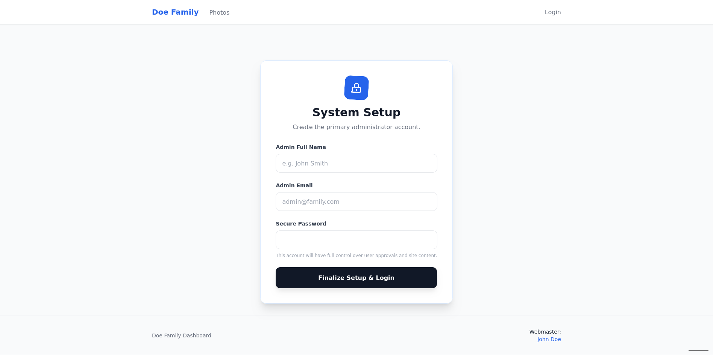
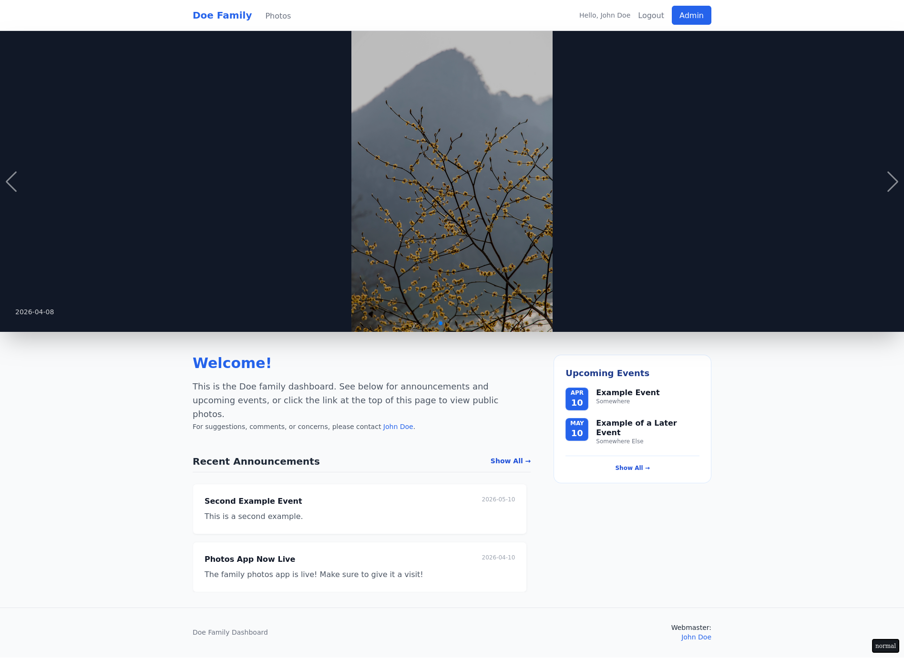
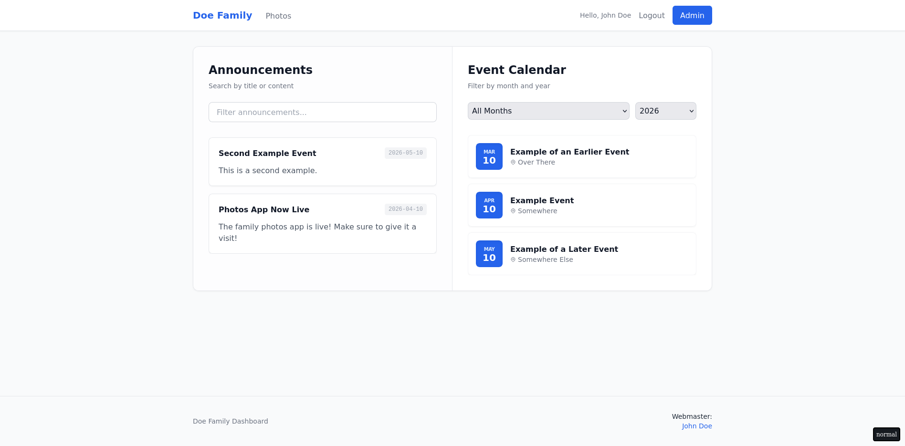
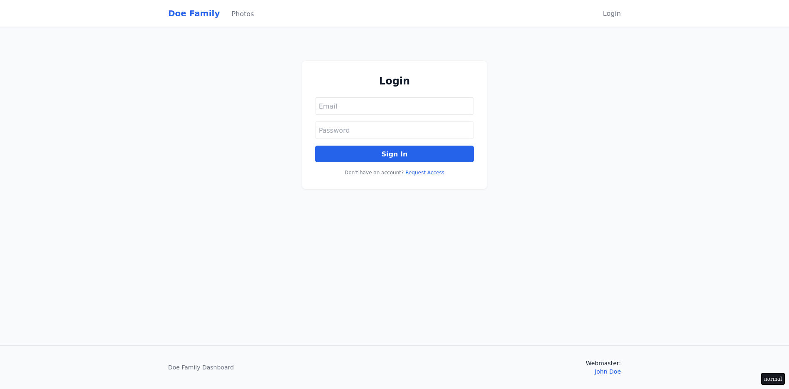
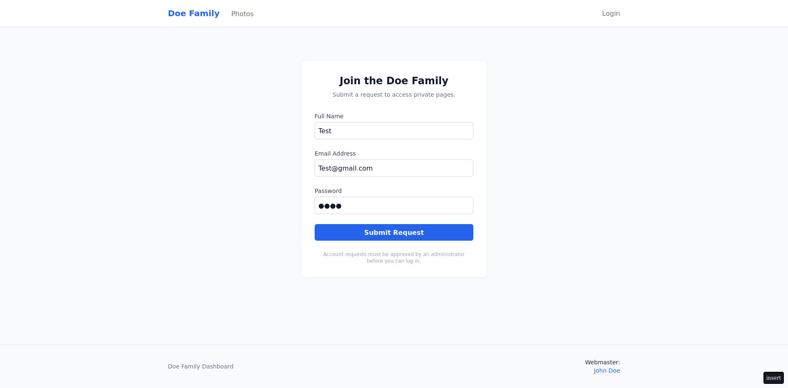
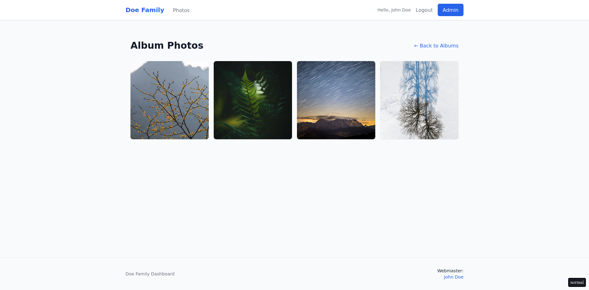
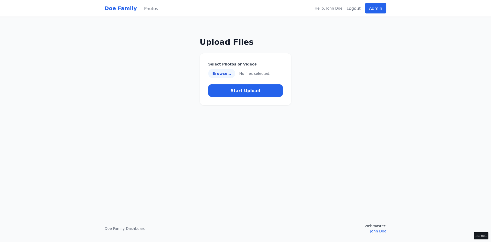

* Family Photo Site

This project is meant to serve as an attractive, clean frontend for an Immich Server for families. It provides basic photo browsing, upload, and download capabilities, alongside user management, and simplified family announcements.

* Getting Started
In order to run an instance of this server, you will need to set up a =docker-compose.yml= file, and a =.env= file in whichever directory you wish to run this server from. Be aware that the server will create a =data/= directory in this folder.
Information on these files is below.
** Docker Compose
The docker compose file is the primary method through which you will configure and run your server. This is how you will set up file access, ports, and environment variables. An example of the minimum required setup is below, along with explanations of variables and their purpose.

Note that changes to variables will not reflect within the service while it is running. If you change variables within the docker compose file, you will need to stop the service and restart it.
#+begin_src yaml
  services:
  family-hub:
    image: ghcr.io/csj7701/family-hub:latest
    ports:
      - "8000:8000"
    volumes:
      - ./data:/code/data
    environment:
      - IMMICH_API_URL=${IMMICH_URL}
      - IMMICH_API_KEY=${IMMICH_API_KEY}
      - SECRET_KEY=${SECRET_KEY}
      - IMMICH_SHOWCASE_ALBUM=immich_album_id_here
      - IMMICH_SHOWCASE_LIMIT=120
      - IMMICH_SHOWCASE_CACHE_CLEANUP_INTERVAL=15
      - IMMICH_ALLOWED_ALBUMS=immich_album_id1_here,immich_album_id2_here,immich_album_id3_here
      - IMMICH_UPLOAD_ALBUM=immich_album_id_here
      - DISK_USAGE_PERC_CUTOFF=75
      - FAMILY_NAME=Jones
      - WEBMASTER_NAME=John Doe
      - WEBMASTER_EMAIL=JohnDoe@gmail.com
#+end_src

*** Variables
- Ports: "xxxx:yyyy" maps the 'xxxx' port on the host to the 'yyyy' port within the container.
- Volumes: "./data:/code/data" means that the local =./data= directory will be accessible within the container as =/code/data=.
- IMMICH_API_URL: The base url for your immich instance. Should be something like "https://photos.your_domain.com".
- IMMICH_API_KEY: Your master API key. The Immich documentation provides instructions on how to generate a key [[https://api.immich.app/getting-started][here]]. It is recommended to create a key /specifically/ for this server. All users, when authenticating to Immich, will use this same key.
- SECRET_KEY: A secret key used to encode information internally. Set this to something secure.
- IMMICH_SHOWCASE_ALBUM: A UUID representing an Immich album. This is the album from which images displayed in the main carousel will come.
- IMMICH_SHOWCASE_LIMIT=The number of images to pull from the IMMICH_SHOWCASE_ALBUM. Image order is not randomized, so if there are specific images you want in the carousel, make sure you either set this number accordingly, or arrange the images in order within Immich.
- IMMICH_SHOWCASE_CACHE_CLEANUP_INTERVAL=How often, in minutes, you want to remove unused images from the carousel's cache.
- IMMICH_ALLOWED_ALBUMS=Comma separated UUIDs representing the albums you wish to be visible in the album list.
- IMMICH_UPLOAD_ALBUM=UUID representing the album that user-uploaded media will be added to within Immich.
- DISK_USAGE_PERC_CUTOFF=At what point you wish users to be unable to upload media to your Immich server. Set this to 0 to disable user uploads entirely. This value is calculated as a percentage of total storage available on disk for the Immich server. Immich calculates this value - so this will be based on whatever disk space Immich was configured with.
- FAMILY_NAME=The family's last name. Used solely for visual elements within the HTML.
- WEBMASTER_NAME=The name you wish to list for the webmaster. Used solely for visual elements with the HTML.
- WEBMASTER_EMAIL=The email you wish to list for the webmaster. Used for a mailto link if users need to contact the webmaster, so this should be a valid email.

Immich's album UUIDs can be found by navigating to an album within your Immich instance. The URL should look something like "https://my-immich-domain.com/albums/long-hyphenated-UUID-here". You can copy the UUID directly from the URL.

** .env
For sensitive information, like public urls, api keys, and secret keys, it is strongly recommended to use a =.env= file. This is /not required/ (you could define this information directly in your docker compose file), but it is still best practice to separate sensitive information.

Example syntax is below, based on the example =docker-compose.yml= above.
#+begin_src
IMMICH_URL=https://your-immich-instance.com
IMMICH_API_KEY=your_super_secret_api_key
SECRET_KEY=generate_a_random_string_here
#+end_src

** Command Line
Run the command =docker compose pull=, then =docker compose up=, and your container will start.
Navigate to the page in your browser, using the port you configured in the docker compose file.
The first time you access the site, you will be asked to enter account information - this will create your initial admin account.

** Announcements
This step is not necessary for initial setup. If you wish to display announcements and events however, you will need to create the =announcements.yaml= file. This is located at =data/announcements.yaml=. Example syntax can be seen below:
#+begin_src yaml
announcements:
  - title: "Photos App Now Live"
    date: "2026-04-10"
    content: |
      The family photos app is live! Make sure to give it a visit!
  
  - title: "Second Example Event"
    date: "2026-05-10"
    content: |
      This is a second example.

events:
  - title: "Example of an Earlier Event"
    date: "2026-03-10"
    location: "Over There"
  - title: "Example Event"
    date: "2026-04-10"
    location: "Somewhere"
  - title: "Example of a Later Event"
    date: "2026-05-10"
    location: "Somewhere Else"
#+end_src

* Features

** Initial Setup
The first time you access your new site, you will be asked to create an account. This is necessary to ensure that your database contains information for at least one account, and that you have an admin user to approve future requests. Do not lose the login information that you set up here. If you do, and do not have access to any other admin accounts, you will have to delete the database file (located at =./data/familyhub.db=) and set up all your accounts again.

** Dashboard
The main landing page for this site. This is fully public, and displays an image carousel with images taken from the =IMMICH_SHOWCASE_ALBUM= configured in your docker compose file. This will pull a limited number of images, configurable with the =IMMICH_SHOWCASE_LIMIT= variable.
Announcements and events are located toward the bottom of the page.

Where the main dashboard displays only a limited subset of announcements and events, the announcements page shows all content, and allows users to filter that information.

** Login
The login page. Users without accounts can request access here, for approval by an admin.

** Albums
The album page allows users to browse albums located on the configured Immich instance. Albums are only visible on this page if they have been designated as an "allowed album" in the docker compose environment.
[[/assets/Photo-Album.png]]

Users can browse all photos that are stored within those albums. While video files are shown in this view, video playback is not supported. Users can, however, download the video files directly and play them locally (though download speeds may be slow).

Users are also able to upload images directly to the immich instance. Upload capability is limited based on available space on the Immich server.

** Admin Dashboard
Accessible from the main navbar whenever logged in as an admin, the administrator's dashboard allows you to approve/deny access requests, adjust settings for existing user accounts, and browse server settings.
[[/assets/Admin.png]]

